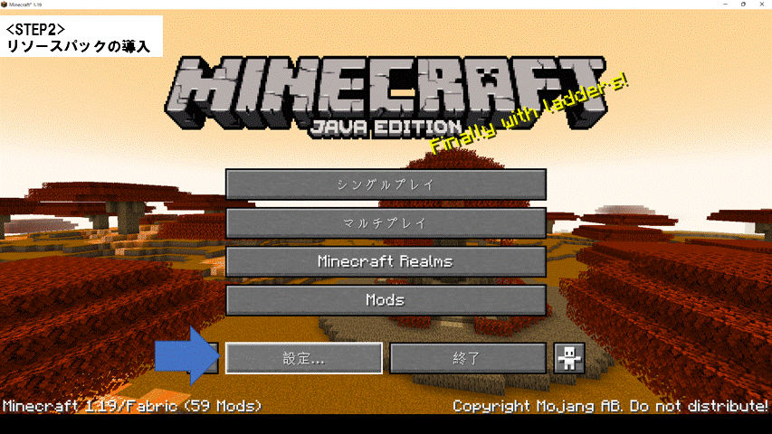
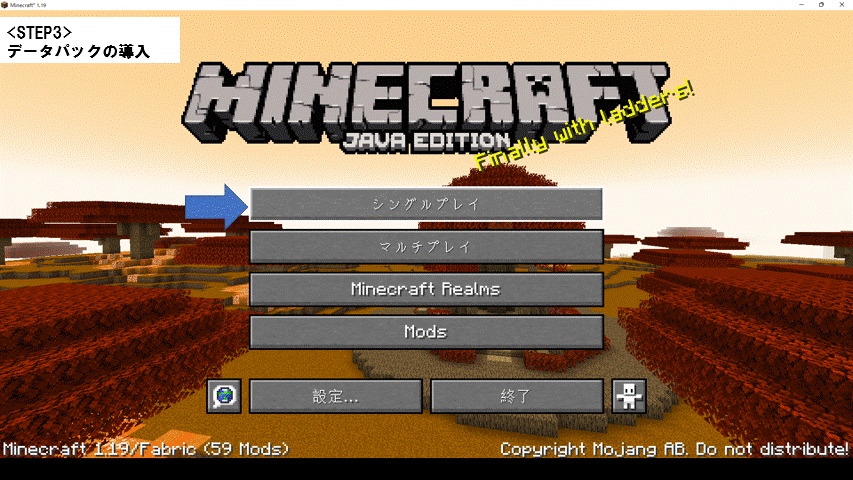

# ItemModifierSample_for1.19.x
ItemModifierのサンプルデタパです

詳しい使い方はこちらの動画をご参照ください。
 
 【サンプルデータパックあります】Item_Modifierってなんですか？
https://youtu.be/2CJMGjlxa_c
  
# 【DL方法と導入のやりかた(データパック初心者向け)】 
## STEP1
右上にある緑色の"Code"をクリックして、"Download ZIP"からDL。
 
DLできたらまずはダウンロード用のフォルダに保存し、右クリック→すべて展開。
 
展開した中に2つの.zipファイルがある事を確認しよう。
 
 
## STEP2
マインクラフトを起動し、
 
「タイトル画面→設定→リソースパック→パックフォルダーを開く」
 
リソースパックフォルダを開いたら、ここに
 
導入したいリソースパックをコピーしよう。
 
「利用可能」にリソースパックが入ったはずだ。これを「選択中」に移動しよう。
 
 
 
## STEP3
「ワールド選択画面→ワールドを選択して「編集」→ワールドフォルダーを開く」
 
ワールドフォルダ開いたら"datapacks"の中に
 
導入したいデータパックをコピーしよう。これで導入は完了だ！
 
 
 
  
